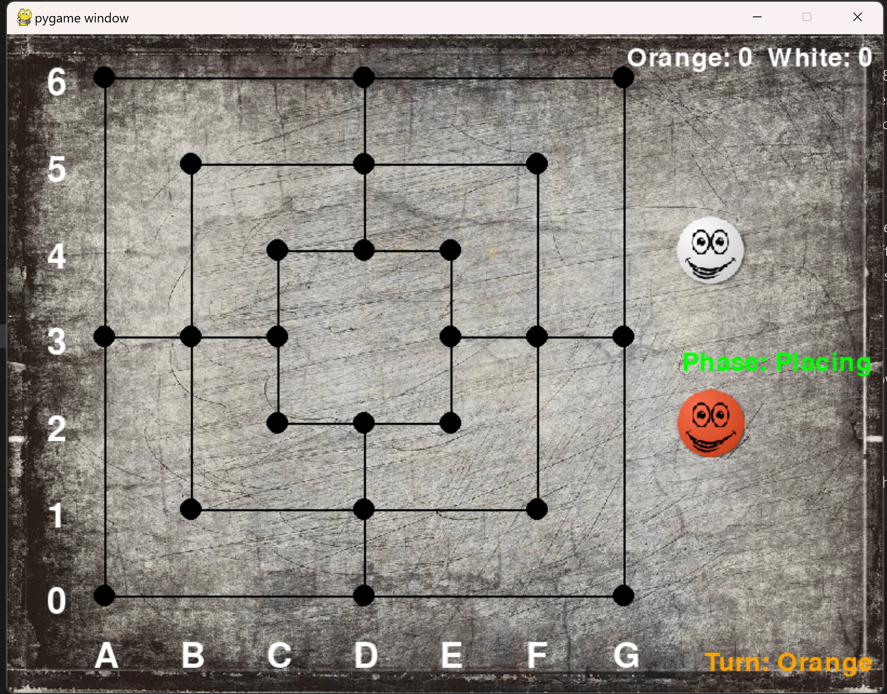

# Nine men's morris

## Description
This is a simple implementation of the game Nine men's morris. The game is played on a board with 24 points and 18 pieces for each player. The goal of the game is to form a mill (three pieces in a row) and remove one of the opponent's pieces. The game is divided into three phases: placing pieces, moving pieces and flying pieces. The game is won by reducing the opponent to two pieces or by blocking the opponent's pieces so that they cannot move.

## How to play
The game is played by two players. The players take turns to place their pieces on the board. Once all pieces have been placed, the players take turns to move their pieces. If a player forms a mill, they can remove one of the opponent's pieces. Once a player has only three pieces left, they can move their pieces to any empty point on the board. The game is won by reducing the opponent to two pieces or by blocking the opponent's pieces so that they cannot move.

## How to run
To run the game, simply run the file `menu.py` in a Python environment. The game will start and you can play by following the instructions on the screen.

### Choosing Difficulty
    The Game uses Minimax algorithm to determine the best move for the AI, Alpha-Beta pruning is also used to optimize the algorithm. Select the Depth of search by choosing difficulty (1-2 for easy, 3-4 for medium, 5-6 for hard, 7+ for very hard). Note that higher depth will take longer to compute. 
    To allow more depth, you could limit the number of searching moves `Max Ops(DEV)`, this will make the tree choose some random branches to explore. 

## How to contribute
If you would like to contribute to the project, you can fork the repository and make changes to the code. Once you have made your changes, you can create a pull request and the changes will be reviewed. If the changes are accepted, they will be merged into the main branch.